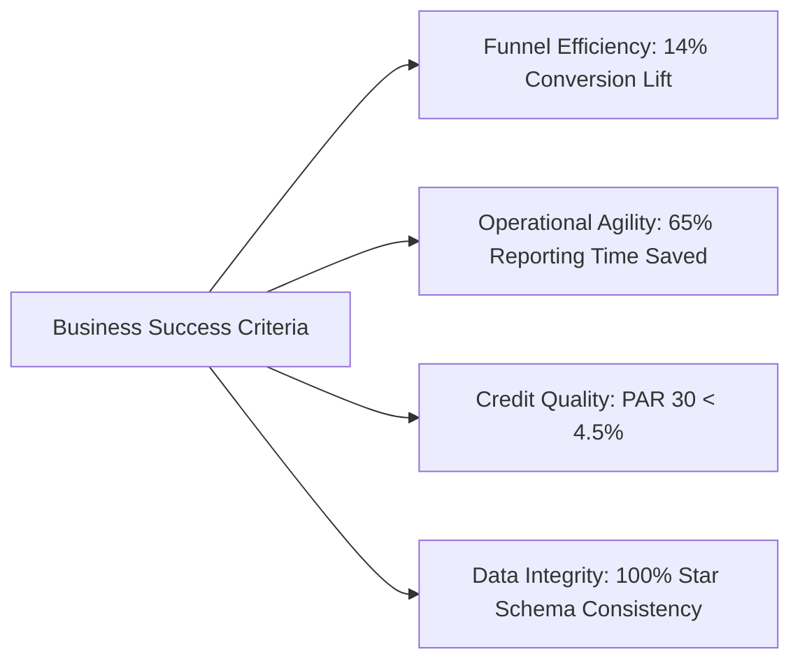

# 📑 Business Requirements Document (BRD)
## Project: Loan Portfolio Funnel & Risk Analytics Platform

---

### Document Control
- **Project Name:** Loan Portfolio Funnel & Risk Analytics
- **Document Version:** 1.0.0
- **Document Status:** Approved / Production-Ready
- **Primary Stakeholders:** Chief Risk Officer (CRO), Head of Lending Operations, Credit Underwriting Committee, Senior Portfolio Analysts

---

## 1. Executive Summary & Business Background
The lending institution operates an online direct-to-consumer and broker-assisted lending platform. In FY2023–FY2024, the business received **over 26,500 loan applications ($180M+ origination pipeline)**. However, only **39.5%** of submitted leads successfully converted into disbursed loans. 

Furthermore, the credit and analytics teams spend **over 7.5 hours every week** manually collating fragmented spreadsheets to assess portfolio health, creating reporting latency and delaying risk interventions.

This project delivers an automated analytics and business intelligence solution to:
1. Diagnose stage-by-stage funnel drop-offs and turnaround SLA bottlenecks.
2. Formulate an actionable optimization strategy targeting a **14% lift in conversions (+$25.2M in originations)**.
3. Establish robust credit risk governance (FICO $\times$ DTI matrices, vintage delinquency curves, PAR 30/60/90 tracking).
4. Automate the reporting refresh cycle via SQL views and Power Query, reducing manual effort by **65% (5 hours/week saved)**.

---

## 2. Business Objectives & Project Goals

| # | Strategic Objective | Baseline Metric | Target Metric | Business Value |
| :- | :--- | :--- | :--- | :--- |
| **BO-01** | **Improve Funnel Conversion Rate** | 39.5% (9,166 loans) | **45.1% (+14% relative lift)** | Adds **+$25.2M** in funded loan volume without increasing marketing acquisition spend. |
| **BO-02** | **Reduce Reporting Cycle Latency** | 7.5 hours/week manual collation | **$\le$ 2.5 hours/week (65% reduction)** | Saves **5 analyst hours/week (~260 hrs/year)** for high-value credit modeling. |
| **BO-03** | **Mitigate Portfolio Credit Risk** | High delinquency in subprime tiers | **PAR 30+ capped $< 4.5\%$** across active book | Prevents bad debt write-offs and protects net interest margin (NIM). |
| **BO-04** | **Underwriting Turnaround Acceleration** | 26.4 hours average stage SLA | **$< 4.0$ hours for prime tiers** | Reduces applicant abandonment and improves competitive take-up. |

---

## 3. Project Scope

### In-Scope:
- Ingestion and harmonization of **26,500+ loan applications** and **129,555 stage transition logs**.
- Stage-by-stage funnel waterfall across 7 milestones (`Lead` $\to$ `Disbursement`).
- Drop-off root cause categorization and SLA turnaround tracking.
- Credit risk rating matrix (Tier A through Tier E vs. DTI brackets).
- Vintage delinquency cohort analysis (2022-Q1 through 2024-Q3).
- Automated reporting pipeline (SQL Materialized Views & Power Query M-scripts).
- 4-page interactive Power BI dashboard and dynamic Excel financial model.

### Out-of-Scope:
- Direct transactional core-banking disbursement execution (read-only analytical replica).
- Third-party credit bureau API billing operations.
- Real-time loan servicing collection calling integrations.

---

## 4. Stakeholder Map & User Personas

| Persona / Stakeholder | Role / Department | Primary Business Need |
| :--- | :--- | :--- |
| **Chief Risk Officer (CRO)** | Executive Leadership | High-level portfolio health, vintage delinquency curves, PAR 30/60/90, expected loss vs. capital reserves. |
| **VP of Lending Operations** | Operations / Funnel Management | Conversion rates across stages, SLA bottlenecks, doc verification pass rates, channel acquisition efficiency. |
| **Credit Underwriting Manager** | Risk & Underwriting | Risk matrices (FICO $\times$ DTI), auto-approval thresholds, policy decline rates, exception tracking. |
| **Senior Financial / BI Analyst** | Data & Analytics | Automated scheduled refreshes, centralized SQL views, reliable semantic data model, dynamic Excel templates. |

---

## 5. Critical Success Factors & Key Performance Indicators (KPIs)

1. **Overall Conversion Rate %**: Total Disbursed Loans / Total Leads Captured.
2. **Stage Drop-Off Rate %**: Count of Dropped Applications / Stage Inflow Count.
3. **Turnaround SLA (Days/Hours)**: Timestamp Delta between stage entrance and exit.
4. **Portfolio at Risk (PAR 30+)**: Total outstanding balance $\ge 30$ DPD / Total Active Outstanding Balance.
5. **Weighted Average APR %**: Principal-weighted annual interest rate across the portfolio.

---

## 6. Project Risks & Mitigation Strategies

| Risk Description | Severity | Likelihood | Mitigation Strategy |
| :--- | :--- | :--- | :--- |
| **Applicant KYC Upload Friction** | High | High | Introduce instant digital bank account linking (e.g., Plaid) to replace manual paystub document uploads. |
| **Credit Risk Contagion in Subprime Tiers** | High | Medium | Implement strict DTI caps ($< 40\%$) and risk-adjusted pricing ($> 19.99\%$ APR) on Tier D/E borrowers. |
| **Data Schema Drift / Broken Refreshes** | Medium | Low | Deploy strict Power Query type-casting and normalized ANSI SQL views with automated primary key validation. |
