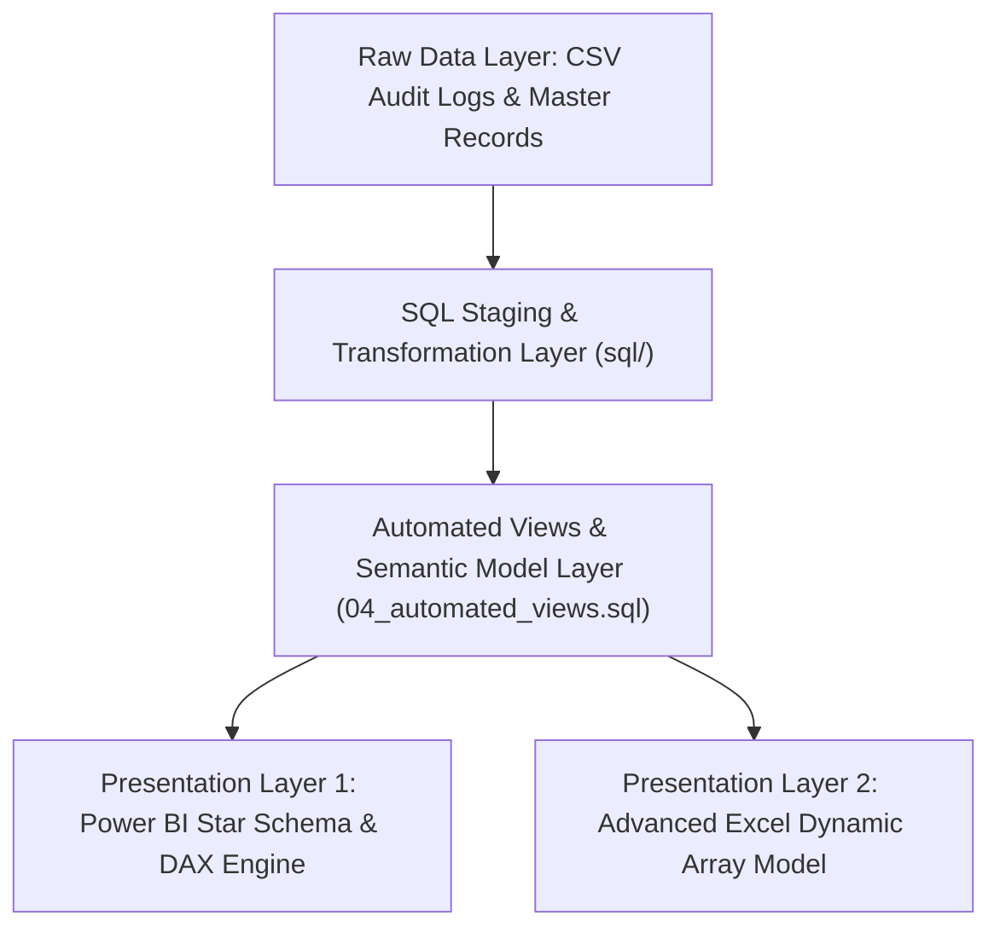

# ⚙️ Functional Requirements Document (FRD)
## Project: Loan Portfolio Funnel & Risk Analytics Platform

---

### Document Control
- **Document Version:** 1.0.0
- **Document Status:** Approved / Technical Baseline
- **Target Audience:** BI Developers, Data Engineers, SQL Developers, QA Analysts

---

## 1. System Architecture Overview

The system follows a 4-tier data warehouse and business intelligence architecture:

---

## 2. Functional Data Requirements & Ingestion Rules

### FR-01: Data Ingestion & Cleansing
- The system **SHALL** ingest transactional application records (`loan_applications_25k.csv`) and timestamped transition logs (`loan_stage_transitions.csv`).
- **Data Validation Rules**:
  - `applicant_age` must be an integer $\ge 18$.
  - `credit_score` must fall strictly between $300$ and $850$.
  - `debt_to_income_ratio` must be a decimal between $0.00$ and $1.00$.
  - Missing drop-off reasons for completed stages **SHALL** be defaulted to empty/null strings.

### FR-02: Funnel Milestone Sequence & State Machine
The system **SHALL** enforce a 7-stage sequential state machine:
1. `Stage 1: Lead Captured` (Entry gate - 100%)
2. `Stage 2: Application Submission`
3. `Stage 3: Document Verification`
4. `Stage 4: Underwriting & Risk Assessment`
5. `Stage 5: Credit Approved`
6. `Stage 6: Offer Acceptance`
7. `Stage 7: Disbursement` (Terminal funded state)

---

## 3. Analytical & Calculation Specifications

### FR-03: Stage-to-Stage Pass & Drop-Off Calculations
- **Formula**:
  $$\text{Stage Pass Rate \%} = \frac{\text{Count of Completed Applications in Stage } N}{\text{Count of Entered Applications in Stage } N} \times 100$$
  $$\text{Cumulative Funnel Conversion \%} = \frac{\text{Count of Completed Applications in Stage } N}{\text{Total Stage 1 Leads}} \times 100$$

### FR-04: Credit Risk Matrix & PAR 30 Formulation
- The system **SHALL** group borrowers into 5 standardized Credit Risk Tiers:
  - **Tier A (Excellent)**: $\text{FICO} \ge 750$
  - **Tier B (Good)**: $700 \le \text{FICO} < 750$
  - **Tier C (Fair)**: $640 \le \text{FICO} < 700$
  - **Tier D (Subprime)**: $580 \le \text{FICO} < 640$
  - **Tier E (Deep Subprime)**: $\text{FICO} < 580$
- **Portfolio at Risk (PAR 30+) Formula**:
  $$\text{PAR 30 \%} = \frac{\sum \text{Outstanding Balance where DPD } \ge 30}{\sum \text{Total Active Outstanding Balance}} \times 100$$

---

## 4. Power BI Dashboard Functional Requirements

### FR-05: Multi-Page Visual Blueprint & Slicers
The dashboard **SHALL** contain 4 dedicated pages:

| Page ID | Page Name | Core Visual Elements | Mandatory Slicers |
| :--- | :--- | :--- | :--- |
| **P1** | **Executive Portfolio Overview** | 6 KPI Summary Cards, Monthly Volume Trendline, Purpose Bar Chart, Channel Donut. | Date Range, Channel, Risk Tier. |
| **P2** | **Funnel & Drop-Off Diagnostics** | 7-Stage Waterfall Funnel, Root-Cause Drop Breakdown, SLA Duration vs. Drop Scatter. | Acquisition Channel, Employment Type. |
| **P3** | **Credit Risk & Delinquency** | FICO $\times$ DTI Heatmap Matrix, Vintage Delinquency Curves (Cohort Line), Expected Loss Chart. | Origination Quarter, Risk Tier. |
| **P4** | **14% Lift Scenario Modeler** | What-If Parameter Sliders (Doc SLA, UW Auto %, Price Match %), Revenue Bridge Waterfall. | Risk Tier, Loan Term. |

### FR-06: Interactive Cross-Filtering & Formatting
- All visuals **SHALL** respond to global slicer selections with $< 1.0$ second DAX evaluation latency.
- Delinquency matrix cells **SHALL** apply conditional formatting:
  - Green: Delinquency Rate $< 2.5\%$
  - Amber: Delinquency Rate $2.5\% - 7.5\%$
  - Red: Delinquency Rate $> 7.5\%$

---

## 5. Automated Refresh & Data Governance Requirements

### FR-07: Automated SQL Reporting Views
- The database **SHALL** maintain 3 production-grade analytical views:
  1. `vw_executive_portfolio_summary`: Single-row KPI snapshot for executive reporting.
  2. `vw_daily_funnel_health`: Daily aggregated channel-by-channel funnel conversion table.
  3. `vw_risk_watchlist`: Real-time risk prioritization table for borrowers with DTI $> 45\%$ or active delinquency.

### FR-08: Power Query Automated Scheduled Refresh
- The Excel and Power BI models **SHALL** execute scheduled data refreshes via standard M-code pipelines without manual column re-mapping or formula repair.
