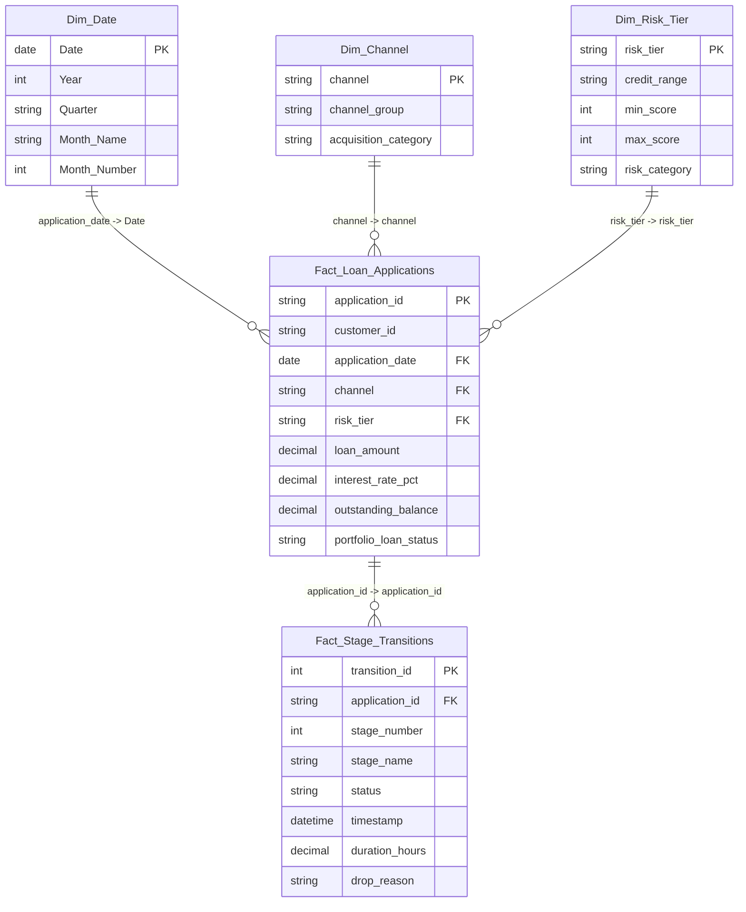

# Power BI Star Schema & Data Model Guide: Loan Portfolio Analytics

This document details the dimensional model, table relationships, and cardinality for building the Power BI `.pbix` report.

---

## 1. Dimensional Architecture Overview

The model follows a high-performance **Star Schema** architecture optimized for VertiPaq compression and fast DAX evaluation.



---

## 2. Table Relationships & Cardinality

| From Table (Dimension / Parent) | To Table (Fact / Child) | Join Key | Cardinality | Cross Filter Direction |
| :--- | :--- | :--- | :--- | :--- |
| `Dim_Date` | `Fact_Loan_Applications` | `Date` $\to$ `application_date` | **1 : Many (1:*)** | Single (`Dim_Date` filters Fact) |
| `Dim_Risk_Tier` | `Fact_Loan_Applications` | `risk_tier` $\to$ `risk_tier` | **1 : Many (1:*)** | Single |
| `Dim_Channel` | `Fact_Loan_Applications` | `channel` $\to$ `channel` | **1 : Many (1:*)** | Single |
| `Fact_Loan_Applications` | `Fact_Stage_Transitions` | `application_id` $\to$ `application_id` | **1 : Many (1:*)** | Both (Bidirectional for cross-funnel filtering) |

---

## 3. Power BI DAX Date Table Creation

Create a dedicated calendar dimension table using the following DAX formula:

```dax
Dim_Date = 
VAR MinDate = DATE(2022, 1, 1)
VAR MaxDate = DATE(2024, 12, 31)
RETURN
ADDCOLUMNS(
    CALENDAR(MinDate, MaxDate),
    "Year", YEAR([Date]),
    "Quarter", "Q" & FORMAT([Date], "Q"),
    "Year_Quarter", YEAR([Date]) & "-Q" & FORMAT([Date], "Q"),
    "Month", FORMAT([Date], "mmm yyyy"),
    "Month_Number", MONTH([Date]),
    "Month_Name", FORMAT([Date], "MMMM"),
    "Day_of_Week", FORMAT([Date], "dddd"),
    "Is_Weekend", IF(WEEKDAY([Date], 2) >= 6, "Weekend", "Weekday")
)
```
