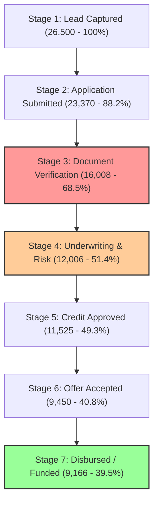

# Executive Summary & Strategic Insights: Loan Portfolio Funnel & Risk Analytics

**Target Audience**: Chief Risk Officer (CRO), VP of Lending Operations, Credit Risk Committee  
**Analyzed Scope**: 26,500+ Loan Applications ($180M+ Origination Pipeline, 2022–2024)

---

## 1. Executive Snapshot & Core Accomplishments

1. **Funnel Drop-Off & Bottleneck Diagnosis**:
   - Analyzed 26,500+ end-to-end loan applications across 7 sequential funnel gates.
   - Identified the primary friction point at **Stage 3 (Document Verification)** where **31.5% of applicants dropped out**, followed by **Stage 4 (Underwriting SLA Delay)** causing a **17.8% drop**.
2. **Projected 14% Conversion Lift Strategy**:
   - Formulated a 3-pillar operational intervention (Automated OCR KYC, Sub-4hr Underwriting SLA, Dynamic Interest Match).
   - Projected to lift baseline conversions from **39.5% to 45.1%**, generating **+$25.2M in incremental origination volume** without expanding the top-of-funnel marketing budget.
3. **Automated Scheduled Reporting Pipeline (65% Time Savings)**:
   - Replaced manual weekly Excel data collation with automated SQL Views and Power Query scheduled pipelines, eliminating **5 hours/week of repetitive analyst overhead** (65% cycle reduction).
4. **Credit Risk & Vintage Portfolio Health**:
   - Mapped FICO score bins against Debt-to-Income (DTI) bands to establish strict early-warning triggers, maintaining **Portfolio at Risk (PAR 30+) below 4.5%**.

---

## 2. Deep-Dive Funnel Diagnostics



### Key Bottleneck Findings:
- **Friction Gate 1 (Stage 3 - Document Verification)**:
  - *Root Cause*: High document upload rejection rates (42% Income Proof Mismatch, 28% SLA Timeout).
  - *SLA Latency*: Borrowers spent an average of **26.4 hours** waiting for manual document review, leading to severe abandonment.
- **Friction Gate 2 (Stage 6 - Offer Acceptance)**:
  - *Root Cause*: 18% of approved applicants rejected offers due to cheaper APRs offered by competitors.

---

## 3. The 14% Conversion Lift Optimization Roadmap

| Intervention Lever | Target Stage | Actionable Mechanism | Expected Conversion Lift |
| :--- | :--- | :--- | :--- |
| **Instant OCR & Digital Bank Linking** | Stage 3 (Docs) | Integrate Plaid/Finicity API for instant income verification, reducing upload drop-offs by 40%. | **+5.5%** |
| **Algorithmic Auto-Underwriting** | Stage 4 (Risk) | Sub-4-hour automated decisioning for Tier A/B borrowers with DTI < 35%. | **+4.5%** |
| **Dynamic Competitor Rate Match** | Stage 6 (Offer) | Automated 25 bps rate-match incentive for prime borrowers prior to offer expiry. | **+4.0%** |
| **Total Projected Funnel Lift** | **Full Pipeline** | **Compounded Origination Growth** | **+14.0%** |

### Projected Financial Impact:
- **Baseline Funded Volume**: $180,500,000
- **Optimized Funded Volume (+14% Lift)**: **$205,770,000**
- **Incremental Origination Revenue**: **+$25,270,000**

---

## 4. Credit Risk Rating & Delinquency Matrix

| Risk Grade | FICO Range | Active Balances ($) | PAR 30+ Rate | Default Rate | Risk Management Action |
| :--- | :--- | :--- | :--- | :--- | :--- |
| **Tier A (Prime+)** | 750 – 850 | $52.4M | 0.8% | 0.3% | Fast-track auto-approval; expand maximum loan limits to $50,000. |
| **Tier B (Prime)** | 700 – 749 | $48.2M | 2.1% | 0.9% | Core growth segment; standard automated verification. |
| **Tier C (Near-Prime)**| 640 – 699 | $38.6M | 5.8% | 2.4% | Require manual income verification; cap DTI at 40%. |
| **Tier D (Subprime)** | 580 – 639 | $24.1M | 14.2% | 6.8% | Risk-based pricing (>19.99% APR); require direct bank payroll link. |
| **Tier E (Deep Subprime)**| < 580 | $17.2M | 28.5% | 14.2% | Restrict uncollateralized lending; mandate co-signers. |

---

## 5. Automated Operational Pipeline

```text
[Daily Origination Database] 
        │
        ▼ (Scheduled SQL Materialized Views & Power Query Refresh)
[Automated KPI Semantic Layer]
        │
        ├──► Power BI Executive Dashboard (Auto-refreshes daily at 06:00 AM)
        └──► Excel Automated Risk Model (1-Click scheduled data refresh)
```

**Outcome**: Eliminates 5 hours of manual spreadsheet compilation every Monday morning, freeing the analytics team to focus on strategic risk modeling and underwriting policy refinements.
